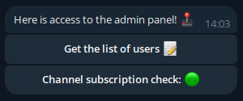

# VirusTotalTGBot

<p align="center">
  
</p>

<p align="center">
   <a href="https://opensource.org/licenses/Apache-2.0">
      
   </a>
   
   
</p>

🦠**VirusTotalTGBot**👾 is a simple Telegram bot that uses the VirusTotal API to scan files and links. It provides
detailed
scan
reports from over 70 antivirus services. The bot can be deployed on any server, making it ideal for checking suspicious
files and links directly from your favorite messenger.

## ✨ Features

1. **🔢 File and Link Scanning:** Scan files (up to 20 MB) and links using the VirusTotal API.
2. **👤 User ID Collecting:** Receive a file containing the IDs of all users interacting with the bot.
3. **🔒 Subscription Verification:** Before using the bot, make sure that users are subscribed to the 4 specified
   channels.
4. **🗨️ Blacklist Management:** Add users to a blacklist to restrict their access.

## 📝 Installation

### ⚙️ Requirements

- **Java 11** is required to run the program. You can download
  it [here](https://www.oracle.com/java/technologies/javase-jdk11-downloads.html).
- **IntelliJ IDEA Community Edition** is recommended for editing the source code. You can download
  it [from the official site](https://www.jetbrains.com/idea/download/).

### 🤖 BotFather

First, you need to create a bot using [BotFather](https://t.me/BotFather).

### 💾 Downloading

1. Download the bot [archive](https://github.com/MrDoodeth/VirusTotalTGBot/releases) (e.g.,
   `VirusTotalTGBot-1.0.0-archive.tar.gz`) and unpack it to a directory of your choice.
2. ️Open the directory in your terminal.

### 📋 Config Editing

To use the bot, you will need your **User ID** and **Channels IDs**. Use [this bot](https://t.me/getmyid_bot) to
get them:

- Forward a message from a channel to get its chat ID.
- Edit `config.json` to update the required fields.

### 🛠 Environment variables

Before entering commands, you first need to become a **ROOT**. Enter `sudo su` on Linux or run cmd as an administrator
in Windows.

- **TG_BOT_API**: Your Telegram Bot API token. Obtain it from [BotFather](https://t.me/BotFather).
- **TG_BOT_NAME**: The name of your Telegram Bot (e.g., `@BotName`).
- **VT_API**: Your VirusTotal API token. Register at [VirusTotal](https://www.virustotal.com) to get it.

Use the following commands to set these variables for the current terminal session:

#### Linux/MacOS

   ``` bash
   export TG_BOT_API="<Telegram Bot API Token>"
   export TG_BOT_NAME="<Telegram Bot Name (@name)>"
   export VT_API="<VirusTotal API Token>"
   ```

#### Windows

   ``` cmd
   set TG_BOT_API=<Telegram Bot API Token>
   set TG_BOT_NAME=<Telegram Bot Name (@name)>
   set VT_API=<VirusTotal API Token>
   ```

### 🚀 Start

To start the bot, run the following command:

#### Linux/MacOS

`java -cp "bin/<jar-archive-name>.jar:lib/*" com.MyDo.Program`

#### Windows

`java -cp "bin\<jar-archive-name>.jar;lib\*" com.MyDo.Program`

If everything is configured correctly, you should see the following output:

`<time> [main] INFO  com.MyDo.Program - Bot started`

## 🔍 How to Use

### 🛡️ File and Link Analysis

Simply send a file or link to check for potential threats.  
**Limit**: The file size should be up to 20 MB.

### 🖥️ Admin Panel



To access the panel, you must add your **User ID** to the `admin-id` field in `config.json`. Send `/admin` in chat to
open the **Admin Panel**, where you can:

- Download a file containing all user IDs.
- Toggle subscription checking for specified channels.

### ⛔ Blacklist

You can block multiple users by adding their IDs to `config.json`. Blacklisted users will be unable to use the bot until
their IDs are removed.

### 📥 Subscription Checking

This feature is enabled by default but can be disabled in the **Admin Panel**.  
To set it up properly:

1. Update the **URLs** and **IDs** in the `chats` section of `config.json`.
2. Add your bot as an administrator in the specified channels.

After completing these steps, the subscription check will work correctly.

## 🤝 Contribution

Feel free to use, modify, and improve this project as you see fit. I welcome any changes or enhancements you wish to
make.

## 📊 Third-Party Libraries

1. [**Telegram API**](https://github.com/rubenlagus/TelegramBots)
2. [**Jackson JSON**](https://github.com/FasterXML/jackson-databind)
3. [**SLF4J**](https://github.com/qos-ch/slf4j) и [**Logback Classic**](https://github.com/qos-ch/logback)

## 🗃️ License

This project is licensed under the Apache License 2.0. See the [LICENSE](LICENSE) file for details.
